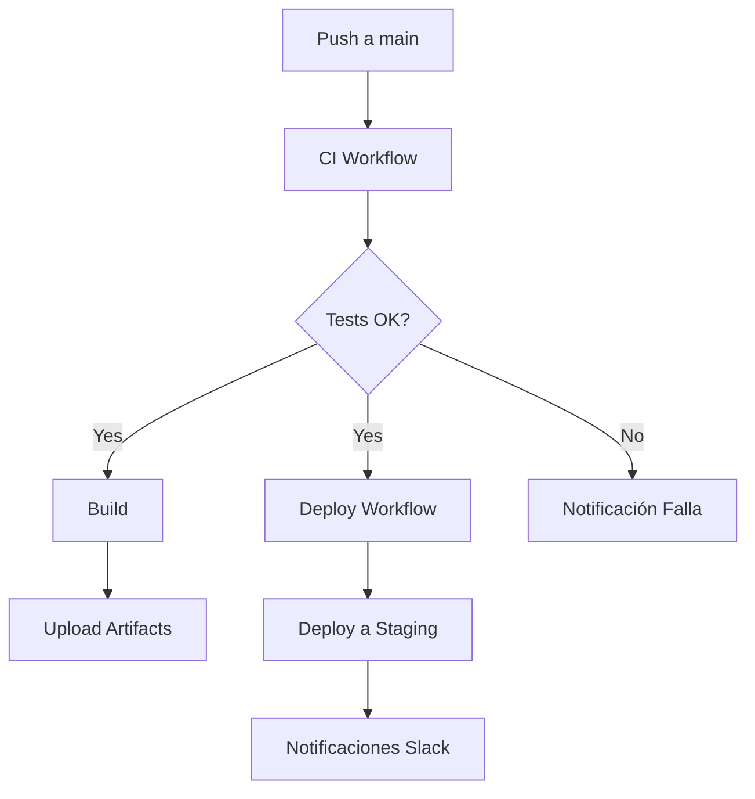

# 📄 Documentación extendida

## Descripción general

Este proyecto implementa un pipeline CI/CD completo usando GitHub Actions para una aplicación web en Node.js con Express.

## Objetivos

- Automatizar las pruebas y el build en diferentes versiones de Node.js.
- Validar la calidad del código antes de integrar cambios.
- Automatizar el deployment al entorno de staging (GitHub Pages).

## Estructura del pipeline

## Tests

- **Unitarios**: Verifican cada endpoint y función aritmética.
- **Integración**: Simulan flujos completos de la aplicación.

## Workflows

- **ci.yml**: Corre tests, build y artifacts.
- **deploy.yml**: Deploy condicional en main, requiere tests pasados.

## Contacto

Autor: Marco Antonio Cruz Mamani
